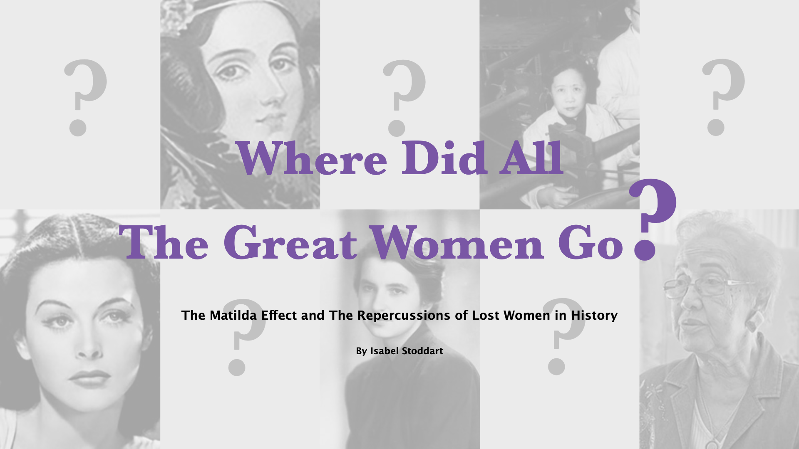

# Where Did All The Great Women Go?
### The Matilda Effect and the repercussions of lost women in history

By [Isabel Stoddart](https://www.isabelstoddart.com/) // [View Live Project](https://isabelstoddart.github.io/matilda-effect/) // [Parsons 2021 Data Visualization](https://parsons.nyc/thesis-2021/)

Abstract
------
Many of the women that have contributed to the scientific field have been lost to history either from their male colleagues taking credit for their work or people deeming their work not important. Women such as Rosalind Franklin, Lisa Meitner, Emilie du Châtelet and many more were lost to history, their contributions to science and technology overlooked. These women were affected by the phenomenon called The Matilda Effect. The Matilda Effect is a bias against acknowledging the achievements of those women scientists whose work is attributed to their male colleagues. This thesis will explore and visualize the connection between The Matilda Effect and women in science today by answering questions such as who the women effected by The Matilda Effect are, what the lasting effects on the world today are, and how female role models can increase the number of girls entering into STEM fields.

Project Preview
------

#### Acknowledgements

###### Submitted in partial fulfillment of the requirements for the degree of Master of Science in Data Visualization at Parsons School of Design // May 2021
